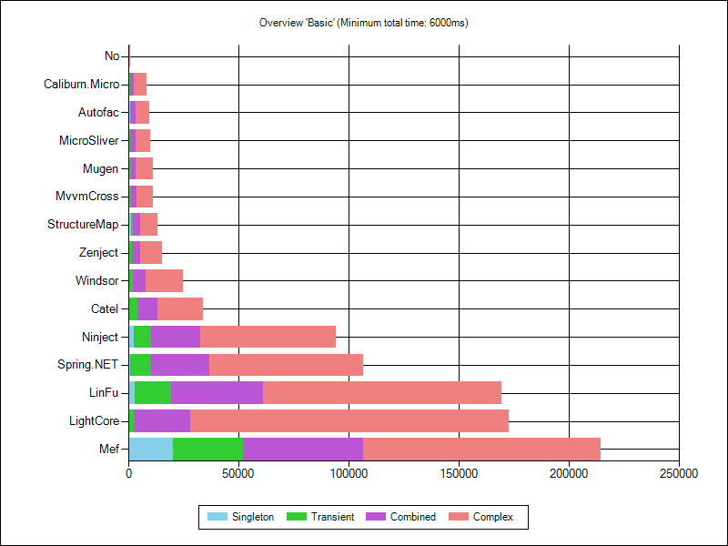
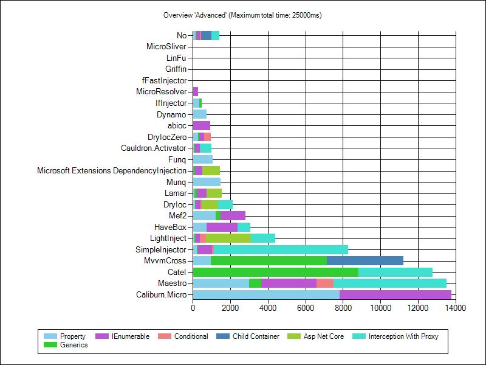

Ioc Performance
===============

This 

Source code of my performance comparison of the most popular .NET IoC containers:  
[www.palmmedia.de/Blog/2011/8/30/ioc-container-benchmark-performance-comparison](http://www.palmmedia.de/Blog/2011/8/30/ioc-container-benchmark-performance-comparison)

Author: Daniel Palme  
Blog: [www.palmmedia.de](http://www.palmmedia.de)  
Twitter: [@danielpalme](http://twitter.com/danielpalme)  

Results
-------
### Explantions
**First value**: Time of single-threaded execution in [ms]  
**Second value**: Time of multi-threaded execution in [ms]  
**_*_**: Benchmark was stopped after 1 minute and result is extrapolated.  
### Basic Features
|**Container**|**Singleton**|**Transient**|**Combined**|**Complex**|
|:------------|------------:|------------:|-----------:|----------:|
|**No**|43 48|46 57|81 77|76 82|
|**[abioc 0.7.0](https://github.com/JSkimming/abioc)**|43 43|39 **49**|64 **63**|60 77|
|**[Autofac 4.8.1](https://github.com/autofac/Autofac)**|594 639|630 537|1980 1766|6417 6534|
|**[Caliburn.Micro 1.5.2](https://github.com/Caliburn-Micro/Caliburn.Micro)**|395 229|472 272|1390 771|5888 3145|
|**[Catel 5.6.0](http://www.catelproject.com)**|258 301|3981 4475|8873 9712|20584 22965|
|**[Cauldron.Activator 3.0.32](https://github.com/Capgemini/Cauldron)**|34 41|44 60|75 84|175 130|
|**[DryIoc 3.0.2](https://bitbucket.org/dadhi/dryioc)**|31 41|44 61|56 79|66 70|
|**[DryIocZero 4.0.0](https://bitbucket.org/dadhi/dryioc)**|98 76|75 76|86 94|206 144|
|**[Dynamo 3.0.2](http://martinf.github.io/Dynamo.IoC)**|85 68|93 83|207 139|621 348|
|**[fFastInjector 1.0.1](https://ffastinjector.codeplex.com)**|69 53|116 92|242 166|558 319|
|**[Funq 1.0.0.0](https://funq.codeplex.com)**|109 81|133 106|366 245|1075 592|
|**[Grace 6.4.1](https://github.com/ipjohnson/Grace)**|**23** 38|34 60|**45** 72|**56** 63|
|**[Griffin 1.1.9](https://github.com/jgauffin/griffin.container)**|274 175|291 195|628 386|1758 988|
|**[HaveBox 2.0.0](https://bitbucket.org/Have/havebox)**|38 45|47 61|64 80|97 87|
|**[IfInjector 0.8.1](https://github.com/iamahern/IfInjector)**|78 59|116 86|138 116|188 130|
|**[Lamar 1.1.1](https://jasperfx.github.io/lamar/)**|63 56|79 76|104 101|119 101|
|**[LightCore 1.5.1](http://www.lightcore.ch)**|173 168|2281 1254|25409 35011|144838* 198335*|
|**[LightInject 5.1.8](https://github.com/seesharper/LightInject)**|26 **37**|**31** 58|47 76|63 **62**|
|**[LinFu 2.3.0.41559](https://github.com/philiplaureano/LinFu)**|3037 1644|16419 10338|41746 25356|108167* 62903*|
|**[Maestro 1.5.4](https://github.com/JonasSamuelsson/Maestro)**|329 237|389 265|912 563|2831 1536|
|**[Mef 4.0.0.0](https://github.com/MicrosoftArchive/mef)**|20118 10987|32123 19262|54379 50162|107807* 131680*|
|**[Mef2 1.0.33.0](https://blogs.msdn.com/b/bclteam/p/composition.aspx)**|207 136|220 153|321 214|609 352|
|**[MicroResolver 2.3.5](https://github.com/neuecc/MicroResolver)**|26 40|33 59|50 69|89 79|
|**[MicroSliver 2.1.6](  )**|202 227|753 520|2395 1643|6677 5764|
|**[Microsoft Extensions DependencyInjection 2.1.1](https://github.com/aspnet/DependencyInjection)**|77 64|108 90|135 119|187 131|
|**[Mugen 3.5.1](http://mugeninjection.codeplex.com)**|476 460|708 798|2063 2775|7717 10160|
|**[Munq 3.1.6](http://munq.codeplex.com)**|85 68|119 98|472 303|1561 857|
|**[MvvmCross 6.1.2](https://github.com/MvvmCross/MvvmCross)**|229 252|922 992|2572 2732|7434 7995|
|**[Ninject 3.3.4](http://ninject.org)**|2613 1890|7584 6263|22328 15373|61634* 45643|
|**[Rezolver 1.3.4](http://rezolver.co.uk)**|165 116|181 136|246 184|378 235|
|**[SimpleInjector 4.3.0](https://simpleinjector.org)**|65 56|84 70|92 89|119 96|
|**[Spring.NET 2.0.1](http://www.springframework.net/)**|890 891|9550 13180|26494 30451|69669* 77039*|
|**[Stashbox 2.6.1](https://github.com/z4kn4fein/stashbox)**|30 38|36 61|51 77|64 70|
|**[StructureMap 4.7.0](http://structuremap.net/structuremap)**|994 557|1159 709|3203 1795|7992 4478|
|**[Unity 5.8.6](https://github.com/unitycontainer/unity)**|270 162|376 249|1108 634|3327 1835|
|**[Windsor 4.1.0](http://castleproject.org)**|426 286|1776 973|5787 3108|16675 8985|
|**[Zenject 7.3.0](https://github.com/svermeulen/Zenject)**|437 549|1286 932|3610 2987|9963 6737|
### Advanced Features
|**Container**|**Property**|**Generics**|**IEnumerable**|**Conditional**|**Child Container**|**Asp Net Core**|**Interception With Proxy**|
|:------------|-----------:|-----------:|--------------:|--------------:|------------------:|---------------:|--------------------------:|
|**No**|141 98|53 67|195 124|58 57|543 324| |439 310|
|**[abioc 0.7.0](https://github.com/JSkimming/abioc)**| | |914 431| | | | |
|**[Autofac 4.8.1](https://github.com/autofac/Autofac)**|6660 6301|1774 1414|7448 6011|1175 1137|67161* 35810|10851 9262|20654 10711|
|**[Caliburn.Micro 1.5.2](https://github.com/Caliburn-Micro/Caliburn.Micro)**|7819 4036| |5951 3160| | | | |
|**[Catel 5.6.0](http://www.catelproject.com)**| |8820 9452| | | | |3939 4247|
|**[Cauldron.Activator 3.0.32](https://github.com/Capgemini/Cauldron)**|44 64|65 **72**|285 193| | | |**612** **399**|
|**[DryIoc 3.0.2](https://bitbucket.org/dadhi/dryioc)**|115 98|49 79|253 170|58 65| |870 538|787 469|
|**[DryIocZero 4.0.0](https://bitbucket.org/dadhi/dryioc)**|270 182|78 78|268 183|333 224| | | |
|**[Dynamo 3.0.2](http://martinf.github.io/Dynamo.IoC)**|733 417| | | | | | |
|**[fFastInjector 1.0.1](https://ffastinjector.codeplex.com)**| | | | | | | |
|**[Funq 1.0.0.0](https://funq.codeplex.com)**|1043 606| | | | | | |
|**[Grace 6.4.1](https://github.com/ipjohnson/Grace)**|92 89|44 77|244 162|**48** **58**|43497 23765|**439** **326**|794 469|
|**[Griffin 1.1.9](https://github.com/jgauffin/griffin.container)**| | | | | | | |
|**[HaveBox 2.0.0](https://bitbucket.org/Have/havebox)**|732 452| |1647 954| | | |677 429|
|**[IfInjector 0.8.1](https://github.com/iamahern/IfInjector)**|350 220|134 113| | | | | |
|**[Lamar 1.1.1](https://jasperfx.github.io/lamar/)**|83 81|121 101|517 317| | |809 478| |
|**[LightCore 1.5.1](http://www.lightcore.ch)**|2046 1670|15474 17370|35033 26530| | | | |
|**[LightInject 5.1.8](https://github.com/seesharper/LightInject)**|100 98|**41** **72**|**238** **161**|328 202| |2380 1682|1301 731|
|**[LinFu 2.3.0.41559](https://github.com/philiplaureano/LinFu)**| | | | | | | |
|**[Maestro 1.5.4](https://github.com/JonasSamuelsson/Maestro)**|3002 1619|660 415|2943 1631|902 533| | |5998 3270|
|**[Mef 4.0.0.0](https://github.com/MicrosoftArchive/mef)**|113888* 137699*|129008* 109517*|89816* 110240*| | | | |
|**[Mef2 1.0.33.0](https://blogs.msdn.com/b/bclteam/p/composition.aspx)**|1229 721|266 179|1303 737| | | | |
|**[MicroResolver 2.3.5](https://github.com/neuecc/MicroResolver)**|**34** **54**| |251 175| | | | |
|**[MicroSliver 2.1.6](  )**| | | | | | | |
|**[Microsoft Extensions DependencyInjection 2.1.1](https://github.com/aspnet/DependencyInjection)**| |129 110|389 238| | |942 600| |
|**[Mugen 3.5.1](http://mugeninjection.codeplex.com)**|10338 10368|55300 57507|5407 7695|1638 2153|573933* 376419*| |14189 29322|
|**[Munq 3.1.6](http://munq.codeplex.com)**|1469 818| | | | | | |
|**[MvvmCross 6.1.2](https://github.com/MvvmCross/MvvmCross)**|948 1027|6198 6536| | |**4088** **2418**| | |
|**[Ninject 3.3.4](http://ninject.org)**|58388 41062|24518 15220|61256* 42380|19949 11790|435571000* 365734939*| |17204 14491|
|**[Rezolver 1.3.4](http://rezolver.co.uk)**|534 325|239 172|8946 4642| |8179875* 4415881*|9143 6857| |
|**[SimpleInjector 4.3.0](https://simpleinjector.org)**|218 148|70 77|742 407|78 72| | |7165 4037|
|**[Spring.NET 2.0.1](http://www.springframework.net/)**|51391 62415*| | | | | |42185 54271|
|**[Stashbox 2.6.1](https://github.com/z4kn4fein/stashbox)**|106 99|48 **72**|257 170|52 **58**|317873* 219028*|676 1042|848 497|
|**[StructureMap 4.7.0](http://structuremap.net/structuremap)**|8417 4696|2223 1315|8352 4592| |3196473* 1749431*|44306 25318|7541 4091|
|**[Unity 5.8.6](https://github.com/unitycontainer/unity)**|3332 1881|1144 661|4049 2263|834 467|5863 9406|14369 13913| |
|**[Windsor 4.1.0](http://castleproject.org)**|32879 17795|14091 7517|14856 8174| |205541* 108275*| |13683 7150|
|**[Zenject 7.3.0](https://github.com/svermeulen/Zenject)**|13240 8144|6796 4149|13243 8863|2923 2307|21211 11956| | |
### Prepare
|**Container**|**Prepare And Register**|**Prepare And Register And Simple Resolve**|
|:------------|-----------------------:|------------------------------------------:|
|**No**|1 |1 |
|**[abioc 0.7.0](https://github.com/JSkimming/abioc)**|6048 |5631 |
|**[Autofac 4.8.1](https://github.com/autofac/Autofac)**|276 |288 |
|**[Caliburn.Micro 1.5.2](https://github.com/Caliburn-Micro/Caliburn.Micro)**|48 |49 |
|**[Catel 5.6.0](http://www.catelproject.com)**|17604 |18036 |
|**[Cauldron.Activator 3.0.32](https://github.com/Capgemini/Cauldron)**|**0** |**0** |
|**[DryIoc 3.0.2](https://bitbucket.org/dadhi/dryioc)**|53 |246 |
|**[DryIocZero 4.0.0](https://bitbucket.org/dadhi/dryioc)**|**0** |1 |
|**[Dynamo 3.0.2](http://martinf.github.io/Dynamo.IoC)**|16854 |16871 |
|**[fFastInjector 1.0.1](https://ffastinjector.codeplex.com)**|7283 |7401 |
|**[Funq 1.0.0.0](https://funq.codeplex.com)**|7 |7 |
|**[Grace 6.4.1](https://github.com/ipjohnson/Grace)**|137 |858 |
|**[Griffin 1.1.9](https://github.com/jgauffin/griffin.container)**|9131 |9201 |
|**[HaveBox 2.0.0](https://bitbucket.org/Have/havebox)**|51547 |51582 |
|**[IfInjector 0.8.1](https://github.com/iamahern/IfInjector)**|1326 |1968 |
|**[Lamar 1.1.1](https://jasperfx.github.io/lamar/)**|1804 |325983* |
|**[LightCore 1.5.1](http://www.lightcore.ch)**|172 |188 |
|**[LightInject 5.1.8](https://github.com/seesharper/LightInject)**|178 |800 |
|**[LinFu 2.3.0.41559](https://github.com/philiplaureano/LinFu)**|94 |330 |
|**[Maestro 1.5.4](https://github.com/JonasSamuelsson/Maestro)**|174 |785 |
|**[Mef 4.0.0.0](https://github.com/MicrosoftArchive/mef)**|14 |2119 |
|**[Mef2 1.0.33.0](https://blogs.msdn.com/b/bclteam/p/composition.aspx)**|5079 |6485 |
|**[MicroResolver 2.3.5](https://github.com/neuecc/MicroResolver)**|26713 |65064 |
|**[MicroSliver 2.1.6](  )**|11 |15 |
|**[Microsoft Extensions DependencyInjection 2.1.1](https://github.com/aspnet/DependencyInjection)**|20 |27 |
|**[Mugen 3.5.1](http://mugeninjection.codeplex.com)**|428 |1757 |
|**[Munq 3.1.6](http://munq.codeplex.com)**|10195 |10276 |
|**[MvvmCross 6.1.2](https://github.com/MvvmCross/MvvmCross)**|9 |12 |
|**[Ninject 3.3.4](http://ninject.org)**|864750* |828996* |
|**[Rezolver 1.3.4](http://rezolver.co.uk)**|10680 |16192 |
|**[SimpleInjector 4.3.0](https://simpleinjector.org)**|623 |3106 |
|**[Spring.NET 2.0.1](http://www.springframework.net/)**|22250 |22311 |
|**[Stashbox 2.6.1](https://github.com/z4kn4fein/stashbox)**|60 |510 |
|**[StructureMap 4.7.0](http://structuremap.net/structuremap)**|1374 |7347 |
|**[Unity 5.8.6](https://github.com/unitycontainer/unity)**|64 |66 |
|**[Windsor 4.1.0](http://castleproject.org)**|2847 |2882 |
|**[Zenject 7.3.0](https://github.com/svermeulen/Zenject)**|137 |146 |
### Charts

